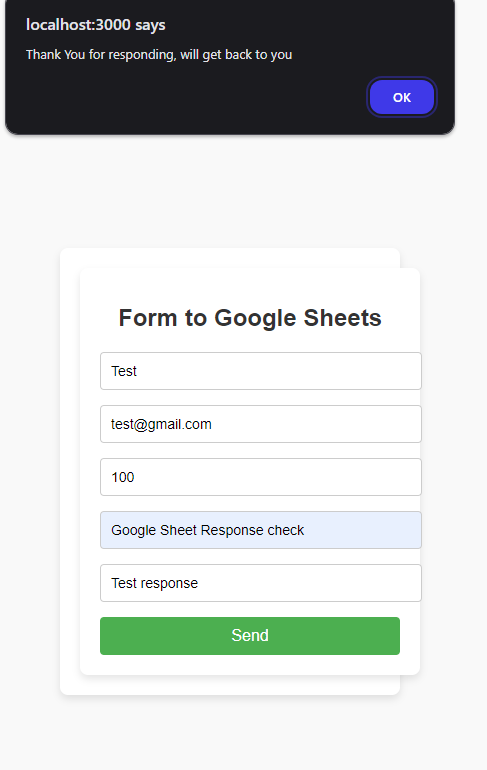

# Form to Google Sheets

# AutoSearch for StackOverflow

[](https://github.com/sarthpatil8/form-to-google-sheets/blob/main/LICENSE)
[](https://github.com/sarthpatil8/form-to-google-sheets/stargazers)
[](https://github.com/sarthpatil8/form-to-google-sheets/issues)


# Project Description

This React application creates a simple form and stores the form responses in a Google Sheets spreadsheet using Google Apps Script. The form collects the user's Name, Email, Mobile Number, Subject, and Message, and then sends this data to a Google Sheet upon submission.

## Features
- Collects user input (Name, Email, Mobile Number, Subject, Message).
- Automatically records the date and time of form submission.
- Uses Google Apps Script to send form data to Google Sheets.

## Prerequisites

To get this project up and running, you need:

- A Google account to access Google Sheets and Google Apps Script.
- A basic understanding of React and Google Apps Script.
- Node.js and npm installed on your machine.

## Setup Instructions

### 1. Create a Google Sheet

1. Create a new Google Sheet where you want to store form responses.
2. Open the Google Sheet, and note the sheet ID (the long alphanumeric string in the URL between `/d/` and `/edit`).

### 2. Create a Google Apps Script

1. Go to the Google Sheet you created in step 1.
2. Open the script editor by navigating to **Extensions > Apps Script**.
3. Delete any default code in the editor and paste the code from the `appScript.txt` file in this repository.
4. In the Apps Script code, replace the placeholder `YOUR_SPREADSHEET_ID` with your actual Google Sheet ID from step 1.
5. Save and deploy the script as a web app:
   - Go to **Deploy > Test deployments > Select type** and choose "Web app".
   - Set **Execute as** to "Me" and **Who has access** to "Anyone".
   - Copy the URL generated after deployment — you will need this in the next step.

### 3. Configure the React App

1. Clone this repository to your local machine.
2. Install dependencies:

    ```bash
    npm install
    ```

3. Create a `config.js` file in the root of the project and paste the following code:

    ```js
    const config = {
      SHEET_URL: 'YOUR_APP_SCRIPT_URL_HERE' // Replace with the URL from the deployed Apps Script
    };

    export default config;
    ```

4. Make sure to replace `YOUR_APP_SCRIPT_URL_HERE` with the URL you copied from the Google Apps Script deployment.

### 4. Run the React App

To run the React app locally:

```bash
npm start
```

### Screenshots
Check out the assets folder for reference 

### Preview

